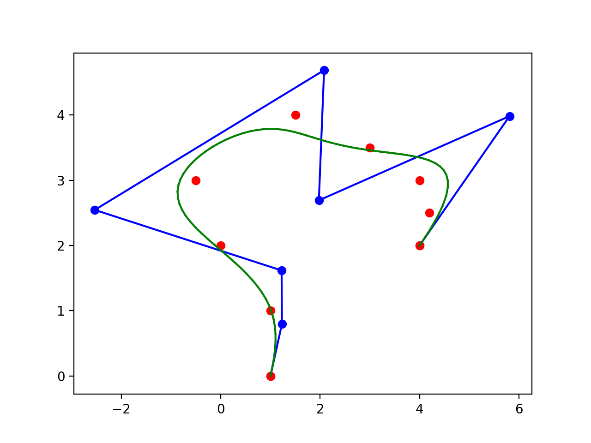
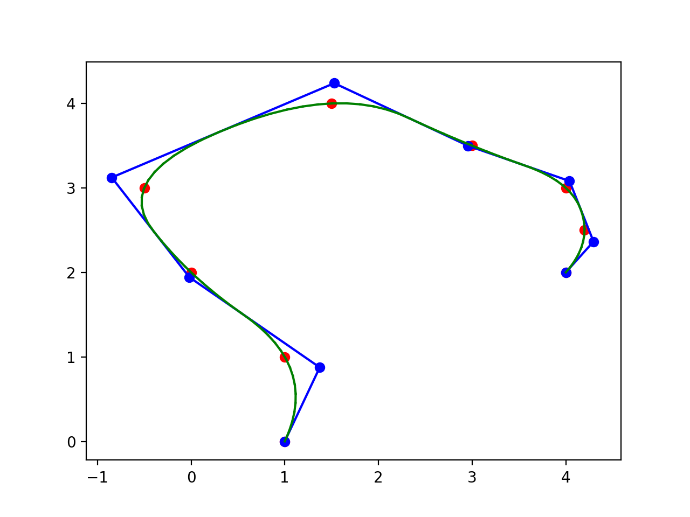
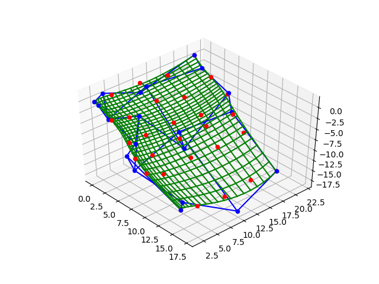
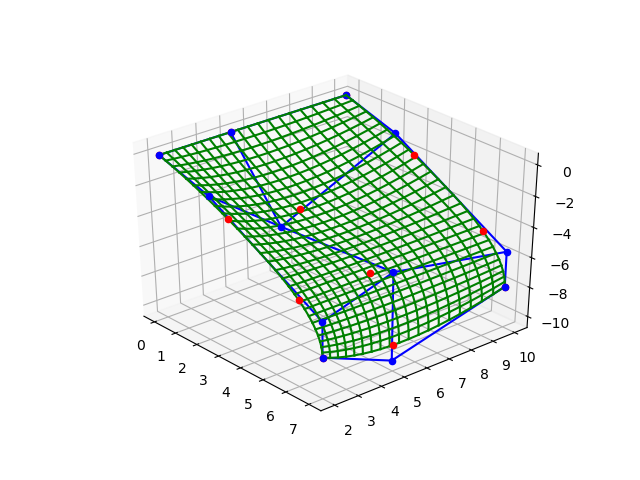

# BSpline
B样条曲面表示的实现，包含均匀B样条和准均匀B样条两种形式。

### 样条基函数
定义在BaseFunction.py文件下，调用BaseFunction()计算每个参数对应的基函数。

### 参数计算
对于已有的数据点，需要将其映射到参数域[0, 1]，在parameter_selection()中提供三种参数域计算方式：
- uniform_spaced(): 参数域均匀分布；
- chord_length(): 根据数据点弦长关系分割参数域；
- centripetal(): 根据数据点弦长的指数结果分割参数域；
通过计算得到的参数域，可以通过求取平均的方式计算节点向量。

## B样条曲线
定义在bspline_curve.py文件下：

- curve_interpolation(): 曲线插值，根据提供的数据点计算经过这些数据点的B样条曲线，返回曲线的控制顶点；
- curve_approximation(): 曲线拟合，根据提供的数据点计算逼近数据点分布的B样条曲线，返回曲线的控制顶点；
- curve(): 计算在曲线上细分后的数据点坐标，需要提供数据点对应参数域分割结果及节点向量，返回曲线上的数据点；

## B样条曲面
B样条曲面数据点需要满足MxN矩阵排布形式，否则无法处理。
定义在bspline_surface.py文件下：

- surface_interpolation(): 曲面插值，根据提供的数据点计算经过这些数据点的B样条曲面，返回曲面的控制顶点；
- surface_approximation(): 曲面拟合，根据提供的数据点计算逼近数据点分布的B样条曲面，返回曲面的控制顶点；
- surface(): 计算在曲面上细分后的数据点坐标；

## 实验结果
### 1. 曲线拟合

### 2. 曲线插值

### 3. 曲面拟合

### 4. 曲面插值

更多插值拟合信息可见"./paper/Fit and Interpolation.pdf"文件。

